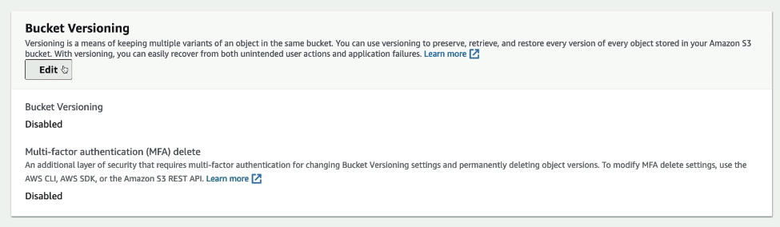
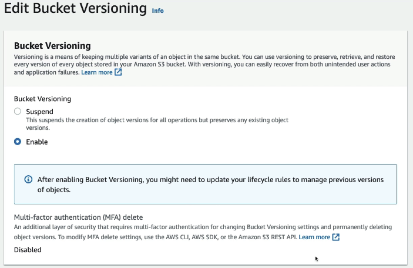
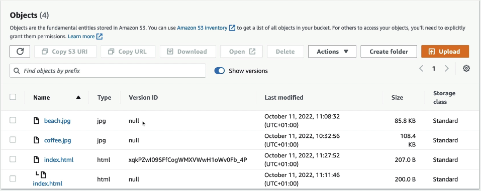

1. Go to **Properties**
 

  Enable bucket versioning
 

 

2. If want to show previous version, enable **show versions**
 

 

3. If want to retrieve previous version, just delete the latest version